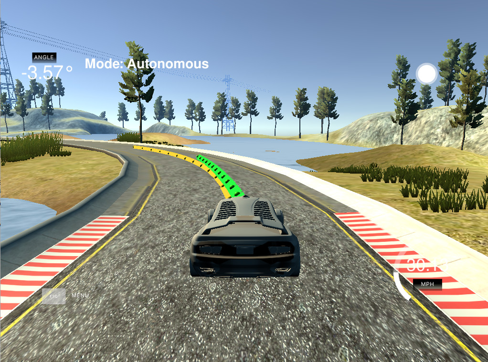

# MPC Vehicle Control

This is a turn-in project based on the Udacity [MPC Vehicle Control project](https://github.com/udacity/CarND-MPC-Project) 
that is part of the self-driving car nanodegree program.  In order to be useful, you will 
also need the Udacity [simulator](https://github.com/udacity/self-driving-car-sim/releases), 
more particularly the version 1.2 simulator that includes the dual color point plotter.

### How To Install

The dependencies for performing the MPC optimization requires a number of third party libraries
be installed.  Of course you will need `make`, `cmake`, in general the `gcc` suite (including 
`gfortran` for Ipopt), so the below list regards specific libs that are more specific to this
particular project:

 * CppAD - `apt install cppad` or build from [source](https://www.coin-or.org/download/source/CppAD/).
 * Ipopt - Just get the [source](https://www.coin-or.org/download/source/Ipopt/) and build it, most packages are not up to 
           date.  Ipopt includes provisions for fetching some of its dependencies, so that should be okay.
 * libhsl.so - Ipopt makes use of dynamic `.so` loading of the sparse solvers, which are not included in the source.  This 
               can be downloaded from the [COIN-HSL Archive](http://www.hsl.rl.ac.uk/ipopt/) under the personal
               license sidebar and manually symlinked to `libhsl.so` so that Ipopt can use it.
 * uWebSockets - Build from [source](https://github.com/uWebSockets/uWebSockets); may have to symlink the `.so` as needed.

If you do not have `CppAD` and `Ipopt` and `uWebSockets` installed properly the project will not compile.  If you do not have `libhsl.so` 
installed properly you will get an indexing error when attempting to access the solver solution, and with a more verbose
output from `Ipopt` some complaints about not finding a sparse solver.  The `Eigen` and `json` libs are packaged with the project,
so no worries about installing those.

In order to build the project, simply create a `/build` folder, run `cmake ..` from within it, and then `make`.  If you
have all of the above installed properly it should build.  I didn't even tamper with the stock `CMakeLists.txt`, so there 
should be no surprises.  It is not the fastest build given the various libs that are used.  Fortunately, `CMakeLists.txt`
already is specifying good optimization (`-O3`) for the build, which is important to this project.

### General Concepts

The basic idea of the MPC approach is to minimize a cost function associated with a kinematic model of 
a vehicle based on an estimated trajectory.  That is, we make a model of the dynamics of the vehicle 
and minimize the cost as a simulation of the vehicle is run.  The model encapsulates details of how the
vehicle will respond in the near future given modeled actuator stimulus and known intial state.  The 
reason we can do this is we can evaluate the kinematic model as a temporal system of equations and 
use an optimization minimizing the cost function to produce a modeled vehicle trajectory that is 
close to the trajectory of interest. 

In most situations involving a car on a map, both with the simulator and in real life, we have access 
to waypoints.  The waypoints are typically in the center of the lane or road, and can act as a guide for
our model.  In the context of the simulator, we are given periodic waypoints in the telemetry data from the
simulator.  A polynomial interpolator is implemented so that we have a parameterized way of generating points along the 
waypoint trajectory in front of the car.  Since waypoints are in map coordinates and the car trajectory and
motion control are in car coordinates, we have to convert from the map to car coordinates.  This essentially
gives us a simpler problem normalized to the car.

Using polynomial interpolation allows us to compute some things very conveniently that are relevant to 
the problem at hand.  For example, we can easily compute the cross-track error since this is simply 
evaluation of the interpolation polynomial at `x=0`.  The car coordinate system is a right-hand
coordinate system with the positive `x` direction directly in front of the car and the positive `y` direction
to the left.  Evaluating the polynomial at `x=0` gives us the expected position of the car in the car 
coordinate frame.  Similarly, the error angle, which is the angle the car is directed from the axis at 
`x=0`, can be computed as arctangent of the derivative of the polynomial evaluated at `x=0`.  These figures, 
combined with the other rest of the state information such as the velocity, allows the model to iteratively 
compute position and ultimately minimize the cost function, yielding a best estimate of tracking the 
interpolated trajectory.

### Kinematic Model

The model that is used is the familiar model from the lessons, and as implemented in the quiz.  To recap,
the relationship between state at time `t` and time `t+1` is as follows:

These equations are used to predict future states of car.  This is done within the context of the `Solve`
method, whereupon the solver optimizes the resulting system of equations with respect to the cost 
function that we define.  There is more information about these ideas throughout the rest of this
document.

### Implementation

Let us first consider aspects of the problem leading up to the use of the `Ipopt` solver.  The telemetry 
data returned from the simulator gives us a number of waypoints.  First thing is to transform these 
points into car coordinates.  Next the polynomial coefficients for the interpolator are calculated.  These 
are used to compute a number of points forward from the car that are plotted in yellow on the simulator.  The number
of points and how far they spaced is adjustable in my code.  There are negative effects in the far horizon on
the curves if you project it too far since this is beyond the waypoints and the polynomial begins to diverge.  As 
noted earlier, the polynomial interpolation is also used for computing the cross-track error and the angle of 
the car relative to the tangent of the waypoint curve at `x=0`.  I created a toy Jupyter notebook for evaluating the
[map and car coordinate transformation](jupyter/MapAndCarGeometry.ipynb) just to be sure the transformation
was right before implementing it in the project.  I explored using polynomials up fifth order, but beyond third
order the tendency was to have untoward instability for large `x` values.  This led to the model having erratic 
behavior, so I ended up using a 3rd order polynomial.

The solver implementation is based in great part on the exemplar code provided in the 
[simulation quiz](https://github.com/udacity/CarND-MPC-Quizzes/blob/master/mpc_to_line/solution/MPC.cpp).  The 
specifics of the vector construction and the state updates using `CppAD` remain mostly untouched.  What
is most notably different is the return values from the optimizer.  Rather than returning the whole
state, we are interested primarily with the actuator values and vectors of points of the prediction.  To make
this a bit more easy to understand in the code, I introduced new class variables and changed the Solve method
signature to return void.  This eliminates two-sided packing and unpacking of vectors.  Obviously 
we only need the first actuator values as this is what we expect to control the car with.  The vector of 
values of prediction points are for plotting on the road in the simulator in green.  By doing this we can see
a smooth line interpolating the waypoints in yellow and the predicted motion computed by the solver.  This has
some consequences in helping tune the cost function to help keep the car on the road.  One small change that I
introduced was using a higher order polynomial evaluation in the model.  This is because I used a higher order
polynomial and wanted to take advantage of it.

The model used in the solver is based on the same model that the lessons used and that the simulation quiz 
used.  However, the cost function is different.  In general, the major difference is scaling of the change in
actuator values.  The reason for this is to make these differences count more in the cost, which causes the 
solver to prioritize this during minimization.  Doing so helps keep the actuation action smoother.  The next
most important factor seems to be the weighting of the cross-track error.  The faster the car is moving, the 
more some of these other aspects of the cost function become important to tune.  Some of the 
default values and extrema have been modified.  For example, it is not necessary for a steady state car on this 
track to use a lot of braking, so there is no reason for this lower bound on this actuator to extend to `-1`.  Rather,
it can be constrained more.  Consequently the lower bound for this actuator was increased to a mild braking
behavior.  It is also not desireable on this track to steer excessively.  If this is needed, the travel on the
track is not very smooth.  Consequently the steering bounds have been tightened.  There is a target value for 
a number of parameters -- speed, cross-track error and angular error.  The cross-track error and angular error
of course are zero, and the speed is whatever one wants to set it to be.  

Once the solver produces a minimal cost state, the car is operated by the first actuator states and the simulator is 
instructed to draw the simulated path based on all coordinate states produced by the solver.  The simulator 
then updates and the cycle repeats.  Tuning the parameters can be a bit of a pain.  The first thing that is important 
as the vehicle speed increases appears to be weighting the intra-sample differences higher, as this makes for a 
significantly smoother estimation.  This is abundandly clear visually using the plots on the simulator.  After this,
the most important thing is adding weighting to the cross-track error and subsequently to the other 
parameters.  As the parameters change, the selection of number of computation steps and the step time also require
adjustment.  Needless to say, the faster the vehicle goes, the more sensitive it is to these changes and the
more prone it is to behave erratically.

### Coding Considerations and Style

The code is written pretty much in the style of the amalgamation of the example quiz and the starting code base of
the project.  One thing that I found quite helpful for keeping track of the indexing and polynomial 
computation was to adopt a rather tabular style of spacing.  I realize this is not normal style for C++, 
but it is effective.  There is no reason to have ambiguity or errors with implementation when the perfectly
good parser is discounting the whitespace anyway.  There were a couple unused variables and some output that 
I didn't find all that helpful, so I removed those.  As noted earlier, I added some properties to the `MPC`
class that are basically used in place of return values from the `Solve` method and adjusted the signature
of the `Solve` method.  The reason for this was simplification of encoding and decoding the various
types of return values.  Since most instances of the use of `size_t` would be compatible with a native
`int` on any platform, I changed that.  I also got rid of the `Hello World` response to an HTTP request
since this project doesn't require that.  I think the code base is a bit more streamlined with some of these
alterations.

### Number of Model Steps and Timestep Interval

As to the question of the number of solver steps and the time period between each step, this is something that 
depends in part on the speed of the solver on the particular computer, the speed of the car on the track, 
specific information about the track such as the tightness of turns, etc.  On the one hand, the more points 
we simulate the more there is contribution to the cost and the more options for the solver to find a minima. On
the other hand, the time it takes increases, the opportunity for finding a poor minima increases, and the 
validity of the cost goes down as the model tracks more and more poorly with actual future car behavior.  That all
said, it is a balance.  

I started with 20 steps and a 50ms interval.  This worked well for lower speeds.  As the speed was increased, 
the distance that the car traveled of course increased in this period.  The error further out in time increased
and the stability of the car was compromised.  As the speed increased, the distance computed needed to be
reduced.  There is a practical minimum interval having to do with the time it takes to perform the model
calculation, so in general the strategy was decreasing the number of steps.  I did find that using less 
than about 10 steps also resulted in instability, probably because the cost function minimization became
more poorly conditioned. Of course you can play with the code, but the values it is at seem to work well 
vis-a-vis the other parameters.

### Latency Considerations

Related to the above is the more general consideration of latency.  That is, the car exhibits motion during the
course of the calculation and the state is not consistent with that of the computation, leading to errors
and potential instability.  The faster the car goes, the more this effect is pronounced.  The indication in 
the code base was to keep latency to 100ms.  This was easily doable in the sense of being able to perform the
calculations in this time.  However, as the speed of the vehicle increases, the relative effect of this 
latency begins to be more and more apparent, manifesting as decreasing stability of the car on the track,
particlarly at the turns.  The reason for this, of course, is that the latency creates a schism between
what the physical car is doing and what the simulated model is doing, all because the times are slightly 
different.  The faster the car moves, the more that matters, and also it matters more on the turns.  

There are a few things that can be done to make a positive impact on the effects of latency. First, it is
possible to attempt to reduce it.  In our situation with the simulator, this has to do with the dynamics of 
the simulator, the time spent performing our computation, the objectives of the assignment, etc.  Other than
decreasing the latency, we can adjust the other parameters of the problem to minimize the car tracking 
errors.  This has been described in greater detail in a previous section.  

### Results

Honestly, I wasn't trying for speed so much as smoothness and understanding the effects of the 
different coefficients used in the computation of cost.  Some of these observations have been 
discussed above.  That said, the way it is set up the car is not going to go at full speed around the
track.  More importantly, the performance of this type of motion controller is quite good.  Here is a 
link to a [YouTube video](https://youtu.be/ogpQ7Ftp5jw) of the results I experienced set up the way seen in this project.  

### Relative Performace

It is very interesting to compare the results using the modeling technique with the same car on the same
track using a PID controller. The PID controller is able to be tuned to specific sections of track well,
but tends to fail on other aspects of the track, becoming grossly unstable.  There is a significant 
difference in tuning parameters for PID controller when the road is straight versus when the road has
a turn.  The PID controller also suffers that it does not have quick adaptation in computing new
coefficients, so it is challenging to get good general performance from a PID controller in this 
context.  On the other hand it has very low latency, so a well-tuned controller for a given section
of track it is tuned for is very well controlled.

The MPC approach is far more adaptive.  At each point in time that actuator values are updated, an
entire collection of future states are computed analytically and optimized using a (sparse) solver that 
has a cost function referencing a specific desired trajectory.  This avails very good tracking within the
means of the model and a wealth of accommodations for boundaries, control values, etc.  In general the
MPC controller gives better composite results on the track, and has myriad more controllability in terms
of bounds and setpoints than the PID controller.  This project definitely demonstrated why the MPC 
approach is commonly used in practice.

### Areas For Improvement

The dominant areas for improvement so with this project include tuning the model for better performance 
not only at higher speed but over a wider range of speeds.  It takes time to learn to understand the 
effects of changing the various parameters, and given the fact that I hand tuned the parameters it is
certain that they are not ideal, and probably not even all that good.  Given the number of parameters 
that go into the model, particularly if you include the bounds applied to the actuators, it is a fairly
large space to search over to find an optimal solution.  One additional area that has room for improvement
is the polynomial fitting of the waypoints.  As new waypoints are encountered and old waypoints are removed
from telemetry, there is a jump in the interpolation that causes erratic car movement.  This could be
accommodated better by smoothing or possibly using a lower order polynomial interpolator.

The code quality and the abstractions made could certainly be better as well.  It pains me to have 
so much code in the main loop in `main.cpp`, but it was expedient writing it that way.  It would be
fun to explore refactorings of this code and see how different design decisions play out.  It seems that 
a lot of these libraries like `Ipopt` that are quite procedural often perpetuate that paradigm, so it is
up to us as the programmers to make more enlightened interfaces that make writing our main control flow
more enjoyable.  There is a great deal of opportunity for that sort of improvement in my code.

### Additional Reading

I have included some literature that I found interesting having to do with the tools and techniques associated
with this project in the `/docs` folder:

 * [MIT Paper](docs/MIT.pdf)

 * [Waechter Paper](docs/Waechter.pdf)

